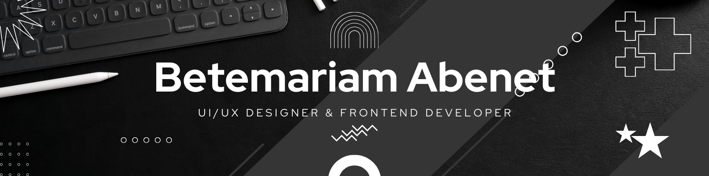

# Hello World!, I'm Betemariam Abenet, a UI/UX Designer and Frontend Developer 👋🏼:
🛜 studying Software Engineering at BITS College 👨🏼‍💻 working as a web developer since 2022  🎬 with experience on web development from small one page websites to AI-driven platforms and complex ERP systems with intricate functionalities.

# 💻 Tech Stack:
        

<picture>
  <source media="(prefers-color-scheme: dark)" srcset="https://raw.githubusercontent.com/Bete77/output/github-snake-dark.svg" />
  <source media="(prefers-color-scheme: light)" srcset="https://raw.githubusercontent.com/Bete77/output/github-snake.svg" />
  
</picture>
